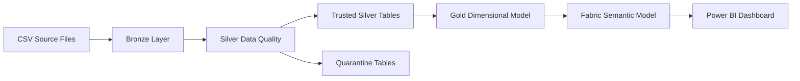
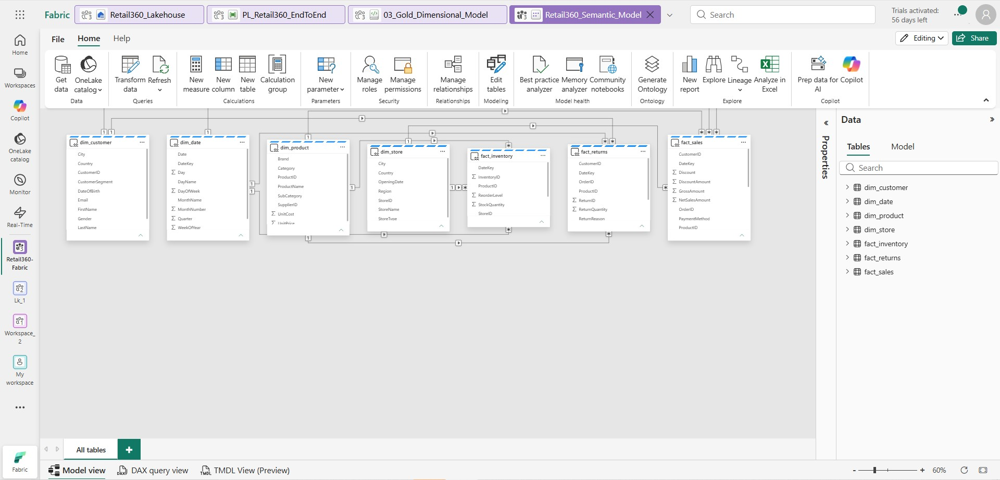
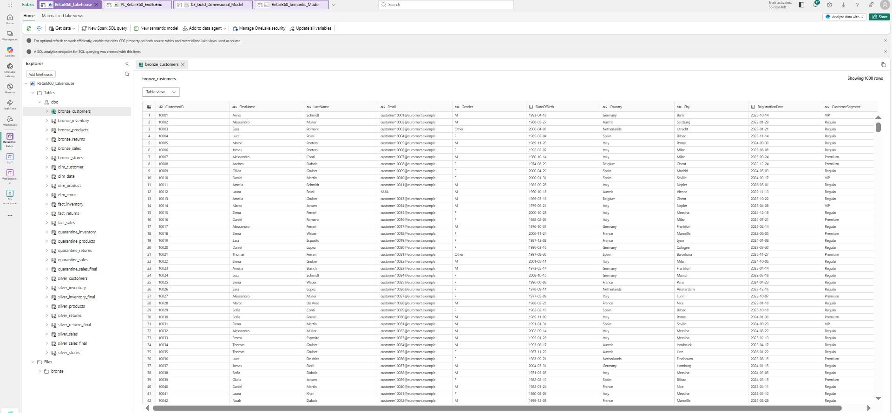
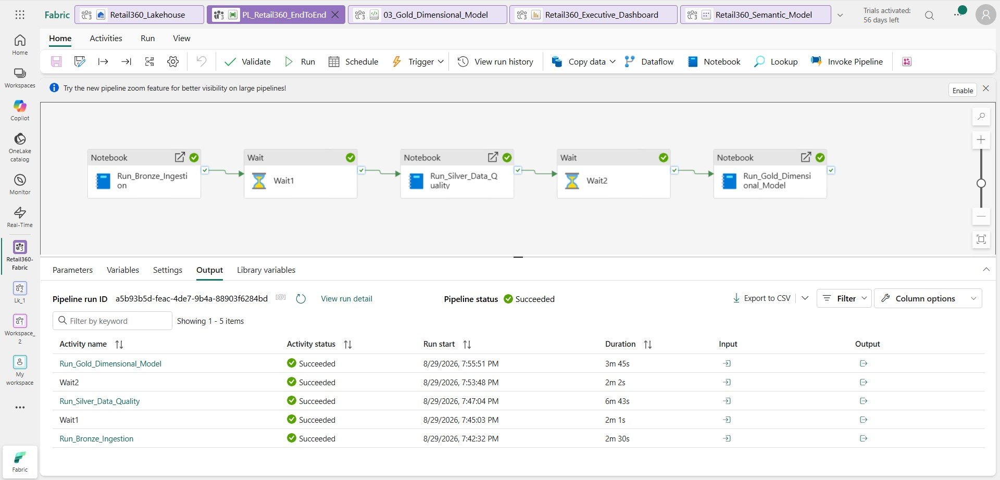
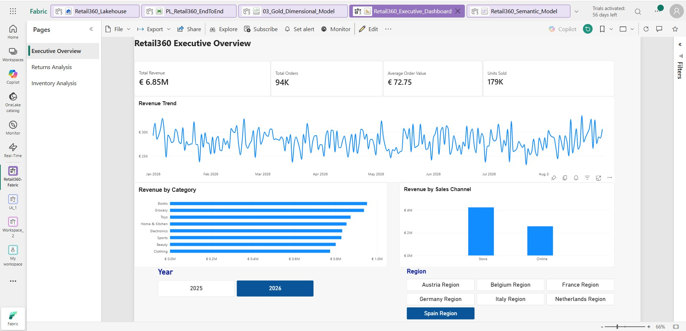
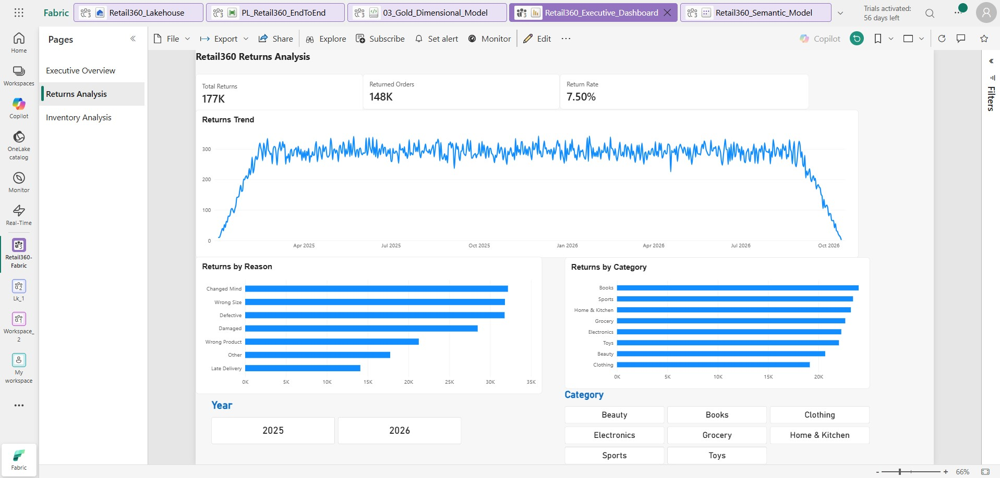
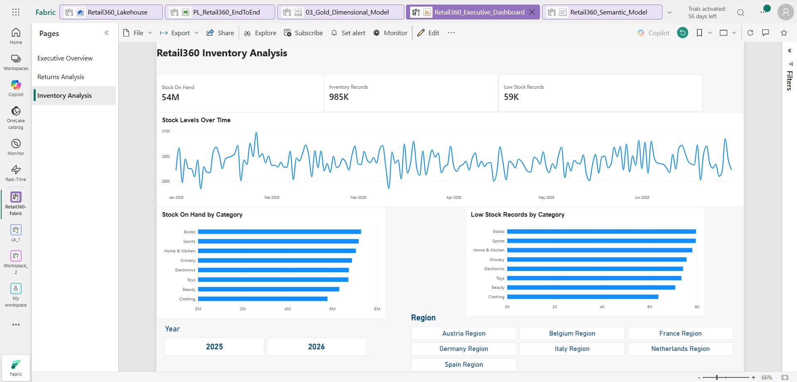

# Retail360 — Microsoft Fabric Data Engineering Project

An end-to-end retail data engineering project built with **Microsoft Fabric**, implementing Medallion Architecture, PySpark-based data transformation, data quality and quarantine handling, dimensional modeling, pipeline orchestration, semantic modeling, and Power BI analytics.

The project demonstrates how raw retail data can be transformed into trusted, analytics-ready datasets through a structured **Bronze → Silver → Gold** architecture.

---

## Architecture



### Data Flow

**Source CSV Files → Bronze Delta Tables → Silver Data Quality → Gold Star Schema → Semantic Model → Power BI**

The solution is orchestrated through a Microsoft Fabric Data Pipeline that executes the Bronze, Silver, and Gold notebooks sequentially.

---

## Technology Stack

- Microsoft Fabric
- Fabric Lakehouse
- Fabric Data Pipelines
- Fabric Notebooks
- Apache Spark / PySpark
- Delta Lake
- Power BI
- Fabric Semantic Model
- GitHub

---

## Dataset

The project uses a retail dataset consisting of six business entities:

- Customers
- Products
- Stores
- Sales
- Returns
- Inventory

The raw CSV files are ingested into the Fabric Lakehouse before being processed through the Medallion Architecture.

---

## Medallion Architecture

### Bronze Layer — Raw Ingestion

The Bronze layer preserves source data in Delta tables with minimal transformation.

The ingestion notebook reads the source CSV files and creates:

- `bronze_customers`
- `bronze_products`
- `bronze_stores`
- `bronze_sales`
- `bronze_returns`
- `bronze_inventory`

A reusable PySpark ingestion function is used to load multiple datasets consistently.

Notebook:

`notebooks/01_Bronze_Ingestion.py`

### Silver Layer — Data Quality & Validation

The Silver layer performs data cleaning, validation, deduplication, standardization, enrichment, and referential-integrity checks.

Key transformations include:

- Duplicate removal
- Null-value validation
- Invalid quantity detection
- Discount validation
- Product price and cost validation
- Text standardization
- Derived sales metrics
- Referential-integrity validation
- Invalid-record quarantine

Derived sales measures include:

- `GrossAmount`
- `DiscountAmount`
- `NetSalesAmount`

Trusted Silver datasets include:

- `silver_customers`
- `silver_products`
- `silver_stores`
- `silver_sales_final`
- `silver_returns_final`
- `silver_inventory_final`

Invalid records are isolated into quarantine tables rather than silently entering the analytical model.

Examples include:

- `quarantine_sales`
- `quarantine_products`
- `quarantine_returns`
- `quarantine_inventory`

Notebook:

`notebooks/02_Silver_Data_Quality.py`

---

## Data Quality & Referential Integrity

The pipeline validates relationships between transactional and master datasets before records enter the Gold layer.

Examples include validating:

- Sales → Customers
- Sales → Products
- Sales → Stores
- Returns → Customers
- Returns → Products
- Inventory → Products
- Inventory → Stores

Invalid foreign-key references are identified using Spark joins and separated from trusted records.

This prevents orphaned transactional records from propagating into the dimensional model.

---

## Gold Layer — Dimensional Model

The Gold layer transforms trusted Silver data into an analytics-ready **star schema**.

### Dimension Tables

- `dim_customer`
- `dim_product`
- `dim_store`
- `dim_date`

### Fact Tables

- `fact_sales`
- `fact_returns`
- `fact_inventory`

The Gold transformation also standardizes key data types and generates integer date keys in `yyyyMMdd` format.

Notebook:

`notebooks/03_Gold_Dimensional_Model.py`

---

## Semantic Model

A Fabric semantic model was created over the Gold tables using one-to-many relationships between dimensions and facts.



The model supports analytical filtering across customers, products, stores, dates, sales, returns, and inventory.

---

## Lakehouse Structure

The Fabric Lakehouse contains Bronze, Silver, quarantine, dimension, and fact tables representing the complete transformation lifecycle.



---

## Pipeline Orchestration

The complete data engineering workflow is orchestrated through the Fabric pipeline:

```text
Run_Bronze_Ingestion
        ↓
      Wait
        ↓
Run_Silver_Data_Quality
        ↓
      Wait
        ↓
Run_Gold_Dimensional_Model
```

Wait activities were introduced between Spark notebook executions to accommodate compute-capacity constraints encountered in the Fabric trial environment.

The final pipeline completed successfully from Bronze ingestion through Gold dimensional modeling.



---

## Power BI Analytics

The Gold dimensional model feeds a Fabric semantic model used by a three-page Power BI report.

### Executive Overview

Provides high-level retail performance indicators including:

- Total Revenue
- Total Orders
- Average Order Value
- Units Sold
- Revenue Trend
- Revenue by Category
- Revenue by Sales Channel



### Returns Analysis

Analyzes product-return behavior using:

- Total Returns
- Returned Orders
- Return Rate
- Returns Trend
- Returns by Reason
- Returns by Category



### Inventory Analysis

Provides visibility into inventory position and low-stock conditions using:

- Stock On Hand
- Inventory Records
- Low Stock Records
- Stock Levels Over Time
- Stock On Hand by Category
- Low Stock Records by Category



---

## Engineering Challenges & Solutions

### Spark Capacity Throttling

During pipeline orchestration, consecutive Spark notebook executions occasionally encountered Fabric trial-capacity throttling.

**Solution:** Wait activities were introduced between notebook executions to allow Spark resources to be released before starting the next workload.

### Referential Integrity

Transactional datasets contained references to products or customers that were not present in their corresponding master datasets.

**Solution:** Spark `left_anti` and `left_semi` joins were used to separate invalid references from trusted records before Gold-layer processing.

### Schema Consistency

Key columns needed consistent data types across dimension and fact tables to support semantic-model relationships.

**Solution:** Key data types were standardized during Gold transformations and Delta schemas were explicitly managed where required.

---

## Repository Structure

```text
Retail360-Fabric-Data-Engineering/
│
├── notebooks/
│   ├── 01_Bronze_Ingestion.py
│   ├── 02_Silver_Data_Quality.py
│   └── 03_Gold_Dimensional_Model.py
│
├── screenshots/
│   ├── 01_Lakehouse_Tables.jpg
│   ├── 02_Semantic_Model_Star_Schema.jpg
│   ├── 03_EndToEnd_Pipeline_Success.jpg
│   ├── 04_Executive_Overview.jpg
│   ├── 05_Returns_Analysis.jpg
│   └── 06_Inventory_Analysis.jpg
│
└── README.md
```

---

## Key Engineering Concepts Demonstrated

This project demonstrates practical implementation of:

- Medallion Architecture
- Lakehouse architecture
- PySpark ETL
- Delta Lake tables
- Data quality validation
- Quarantine patterns
- Referential-integrity enforcement
- Dimensional modeling
- Star schema design
- Fact and dimension tables
- Pipeline orchestration
- Spark workload management
- Semantic modeling
- Power BI analytics

---

## Future Improvements

Potential extensions include:

- Parameterized and metadata-driven ingestion
- Incremental loading instead of full overwrite
- Slowly Changing Dimensions (SCD)
- Automated data-quality metrics and logging
- Pipeline monitoring and alerting
- Environment-specific configuration
- CI/CD and deployment pipelines

---

## Project Outcome

Retail360 demonstrates an end-to-end Microsoft Fabric data engineering workflow that transforms raw retail files into validated, analytics-ready dimensional datasets and exposes them through an interactive Power BI reporting layer.

The project focuses on the complete engineering lifecycle:

**Ingestion → Data Quality → Quarantine → Transformation → Dimensional Modeling → Orchestration → Semantic Modeling → Analytics**
